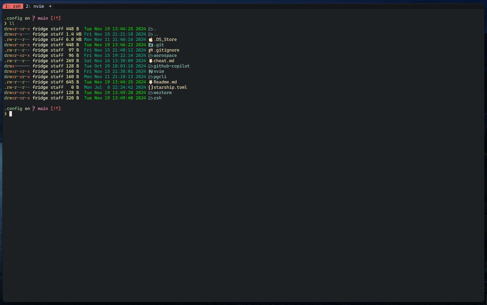
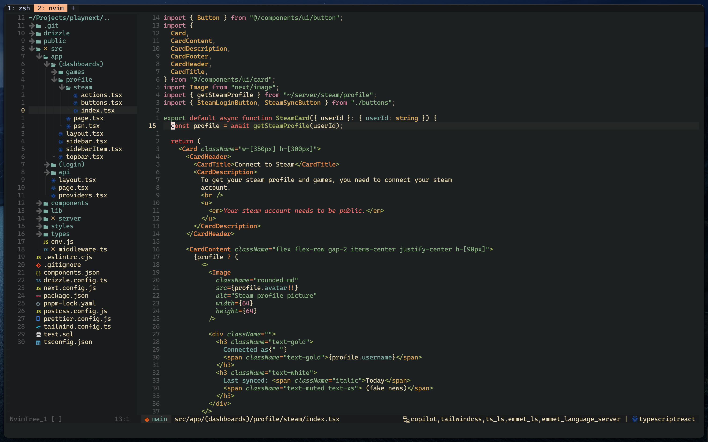
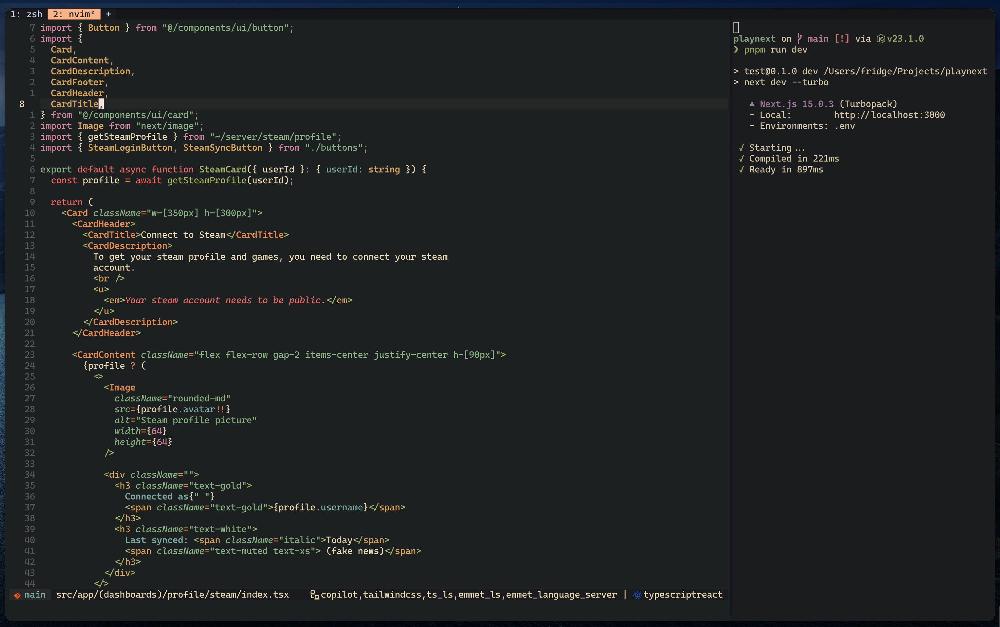

# My beloved Mac setup 2024
> [!Note]
> Current setup that i'm running + my nvim trial period.
> Don't talk to me if this doesn't work 🙏

## Screenshots





## Features
* [X] Pretty via starship
* [X] Full fledged Nvim support
* [X] Beutiful font 🧑‍🍳 `Cascadia Mono NF` + ligatures
* [X] Wezterm tmux capabilities 
* [X] Avante support (similar to Cursor AI)
* [X] Add markdown support. 
* [X] Emacs like git support via `fugitive`

## Prerequisits
```bash
brew install wezterm
brew install lsd
brew install nvim
brew install starship
```

## TODOs
* Try ghost terminal. I've left alacritty for WezTerm and so far it's great! 
* Potentially try `fish`?
